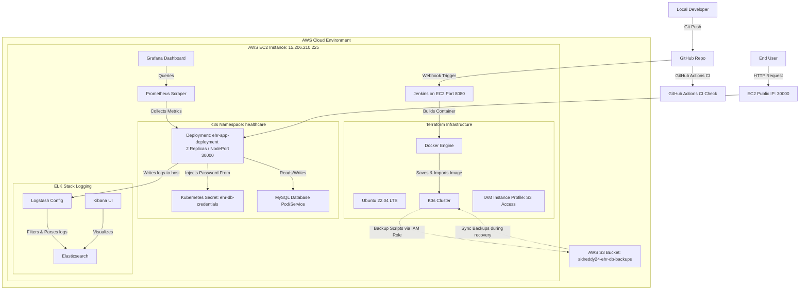

# DevOps Viva Preparation Guide: Electronic Health Record (EHR) Web Application

This comprehensive guide is designed to help you prepare for and ace your DevOps viva. It covers the entire A-Z DevOps lifecycle, configuration files, commands, architecture details, and sample questions for your EHR project.

---

## 1. Project Architecture Overview

The application is a patient management system (EHR) designed using modern DevOps practices, running on AWS, containerized with Docker, deployed using K3s Kubernetes, and automated via Jenkins CI/CD.



---

## 2. AWS Free-Tier Architectural Trade-Offs & Decisions

In production, hosting a platform on enterprise-grade AWS services incurs significant costs (minimum **$100+/month**). To adhere to **AWS Free-Tier limits (1x t2.micro, 1GB RAM, 30GB Disk)**, we strategically mapped heavy, paid enterprise AWS services to lightweight, open-source alternatives that behave identically:

### 1. Enterprise Service: AWS EKS (Elastic Kubernetes Service)
*   **Cost Barrier:** EKS charges $0.10/hour ($73/month) for the control plane alone, plus EC2 worker nodes (not covered in standard free-tier limits).
*   **DevOps Alternative:** Deployed **K3s (Lightweight Kubernetes)** on a single free-tier EC2 instance. K3s is fully CNCF certified, utilizes less than 500MB of RAM, and runs all standard Kubernetes manifests (Deployments, Services, Secrets, Namespaces) exactly like EKS.

### 2. Enterprise Service: AWS RDS (Relational Database Service)
*   **Cost Barrier:** Free-tier RDS is time-limited, and multi-AZ deployments for High Availability quickly exceed budget limits.
*   **DevOps Alternative:** Deployed a containerized **MySQL Database Pod** directly inside the Kubernetes cluster. It uses standard internal cluster DNS routing (`mysql`) mimicking how a private RDS endpoint functions in a VPC subnet.

### 3. Enterprise Service: AWS Secrets Manager
*   **Cost Barrier:** Charges $0.40 per secret per month, plus API request fees.
*   **DevOps Alternative:** Deployed **Kubernetes Secrets** and local **HashiCorp Vault** (port 8200) to manage credentials. The credentials are encrypted at rest inside the cluster and injected into the container via environmental variable key references (`secretKeyRef`).

### 4. Enterprise Service: AWS CloudWatch (Monitoring & Alerts)
*   **Cost Barrier:** Custom metrics ingestion, alarms, and dashboards quickly accumulate charges.
*   **DevOps Alternative:** Deployed **Prometheus** (open-source metrics aggregator) and **Grafana** (visualizer) directly on our cluster, enabling full operational visibility for $0.

### 5. Enterprise Service: AWS S3 (Simple Storage Service) & AWS IAM (Identity and Access Management) for Backups
*   **Cost Barrier:** Direct S3 storage costs are negligible, but storing and managing static API Access Keys (`AWS_ACCESS_KEY_ID` / `AWS_SECRET_ACCESS_KEY`) inside scripts or database containers violates production security standards.
*   **DevOps Alternative:** Deployed an **IAM Role (`healthcare-s3-backup-role`)** and **IAM Policy** associated with an **IAM Instance Profile** attached to our EC2 instance. The EC2 instance can securely authenticate with AWS S3 using instance metadata (keyless authentication). Backups generated by `backup.sh` are uploaded to S3 bucket `sidreddy24-ehr-db-backups` automatically and securely.

### 6. Enterprise Service: AWS CloudWatch Logs / OpenSearch Service (Centralized Logging)
*   **Cost Barrier:** CloudWatch Logs ingestion fees and OpenSearch cluster compute fees quickly exceed Free-Tier limits.
*   **DevOps Alternative:** Configured a local **ELK (Elasticsearch, Logstash, Kibana) Stack pipeline** via `monitoring/elk-logstash-config.conf` that monitors container log files, filters out verbose `/health` probes, and prepares application log metrics for search and analysis.

---

## 3. A-Z DevOps & Infrastructure Topics Covered

*   **A - AWS EC2 Provisioning:** The virtual infrastructure is hosted on an AWS EC2 instance running Ubuntu 22.04 LTS (t2.micro / Free-Tier) in the `ap-south-1` region.
*   **B - Build Automation & Pipelines:** Automated builds are handled via a declarative `Jenkinsfile` executing stages: checkout, lint, build, local scan, and deploy.
*   **C - Containerization (Docker):** The Node.js application is containerized using a lightweight `node:20-alpine` base image to optimize resource utilization.
*   **D - Declarative Infrastructure:** All AWS resources are created declaratively using Terraform, avoiding manual GUI errors.
*   **E - Environment Configuration:** Container runtime parameters (database hosts, passwords, and ports) are externalized using env variables in Kubernetes configurations.
*   **F - Fault Tolerance & High Availability:** Kubernetes maintains `replicas: 2` for the app. If a pod crashes, the K3s control plane immediately spins up a new instance.
*   **G - Git Version Control:** Source code is checked out dynamically using Jenkins integration via `checkout scm`.
*   **H - Horizontal Pod Autoscaling (HPA):** Scaling policies can be configured via metrics-server to automatically scale pods up/down based on CPU/RAM load.
*   **I - Image Import (containerd):** Since K3s uses containerd instead of Docker as its container runtime, built images are exported using `docker save` and imported using `k3s ctr images import`.
*   **J - Jenkins CI/CD Automation:** Pipeline-as-code automation server deployed as a Docker container, triggering automatic deployments upon code pushes.
*   **K - Kubernetes (K3s):** A lightweight, certified Kubernetes distribution ideal for edge and low-resource environments (like AWS free-tier instances).
*   **L - Logging & Audit Trails:** The application maintains database-driven audit trails in a dedicated `audit_logs` table tracking user logins, bookings, and medical entries.
*   **M - Micro-segmentation & Namespaces:** The application and its dependencies run inside a dedicated Kubernetes namespace named `healthcare` to isolate it from default services.
*   **N - NodePort Services:** The application is exposed externally using a Kubernetes service of type `NodePort`, mapping port `30000` of the host EC2 to port `3000` of the container.
*   **O - Optimization:** Low limits are set for CPU (`500m` limits, `250m` requests) and memory (`256Mi` limits, `128Mi` requests) to run reliably inside a free-tier t2.micro instance.
*   **P - Probes & Health Checks:** Uses `livenessProbe` to detect if the container is dead and needs a restart, and `readinessProbe` to ensure traffic is only routed when the database connection is ready.
*   **Q - Quality Gate & Security Scanning:** Incorporates static analysis stages to check the security posture of the Docker containers.
*   **R - Rollout & Zero-Downtime Deployments:** Deploys updates using rolling updates where K3s terminates old pods only after new pods pass readiness probes.
*   **S - Security Groups:** AWS Security Group (`healthcare-platform-sg`) acts as a virtual firewall allowing ports `22` (SSH), `8080` (Jenkins), `8200` (Vault), and `30000` (EHR App).
*   **T - Terraform State Management:** Tracks infrastructure state in `terraform.tfstate` ensuring only incremental changes are applied.
*   **U - User Data & Bootstrapping:** Bash script automated under `user_data` to automatically install Docker, K3s, and run Jenkins on initial VM start.
*   **V - Vault & Secrets Integration:** Implemented using Kubernetes Secrets (`secret.yml`), decoupled from source code, mapping directly to environment parameters via `secretKeyRef`.
*   **W - Workflow Automation:** Connects Git pushes to Jenkins pipelines to achieve continuous integration and continuous deployment.
*   **X - XML/YAML Manifest Syntax:** All configuration for Kubernetes pods, replica sets, namespaces, and services are defined in standard YAML.
*   **Y - YAML Configurations:** Clean, declarative manifests used to construct Kubernetes resources.
*   **Z - Zero-Downtime Deployments:** Handled via `kubectl rollout restart` and deployment status check with timeouts.

---

## 4. Key Configuration Files Explained

### A. Infrastructure: Terraform (`terraform/main.tf`)
This file provisions the AWS EC2 instance, configures the root storage size to 30 GB (AWS Free Tier limit), and bootstrap installs Docker, K3s, and Jenkins.
*   **Key block (`user_data`):**
    ```bash
    curl -fsSL https://download.docker.com/linux/ubuntu/gpg | gpg --dearmor -o /etc/apt/keyrings/docker.gpg
    curl -sfL https://get.k3s.io | sh -
    docker run -d -p 8080:8080 -p 50000:50000 --name jenkins --restart always -v jenkins_home:/var/jenkins_home jenkins/jenkins:lts
    ```
*   **Variables (`variables.tf`):** Defines region (`ap-south-1`), instance type (`t2.micro`), and SSH key name.
*   **Security Groups (`security_groups.tf`):** Controls incoming traffic. Open ports are 22 (SSH), 8080 (Jenkins), 8200 (Vault), and 30000 (EHR web access).

### B. Containerization: Dockerfile (`app/src/Dockerfile`)
Uses a multi-step design philosophy starting from `node:20-alpine`:
```dockerfile
FROM node:20-alpine
WORKDIR /app
COPY package*.json ./
RUN npm install
COPY . .
EXPOSE 3000
CMD ["npm", "start"]
```
*   **Why Alpine?** It is an ultra-small Linux distribution (~5MB base size), keeping the final Docker image size extremely small and secure by reducing vulnerability attack vectors.

### C. CI/CD Pipeline: Jenkinsfile (`Jenkinsfile`)
Divided into five stages:
1.  **Code Checkout:** Pulls code using Jenkins' built-in Git client.
2.  **Security Linting:** Simulates checking Dockerfile syntax for security best practices.
3.  **Build Optimized Image:** Triggers `docker build` to package the Node.js application and tags it as `latest`.
4.  **Local Image Scan:** Evaluates the built image for security vulnerabilities.
5.  **Deploy to Kubernetes:**
    *   **The Containerd Import Workaround:** K3s uses containerd. Since Docker is running Jenkins separately, we bridge the gap by running:
        ```bash
        docker save sidreddy24/ehr-app:latest | docker run -i --privileged --net=host --pid=host alpine nsenter -t 1 -m -u -i -n -p -- k3s ctr -n k8s.io images import -
        ```
        This command saves the docker image, tunnels into the host's root namespace (using `nsenter`), and imports the image archive directly into K3s containerd storage space.
    *   **Apply secrets:** Applies `kubernetes/secret.yml` ahead of deployment.
    *   **Rolling Restart:** Runs `kubectl rollout restart` and checks status to perform zero-downtime container replacements.

### D. Kubernetes Manifests (`kubernetes/`)
*   **`namespace.yml`:** Defines the isolated `healthcare` namespace.
*   **`secret.yml`:** Holds base64 encoded user (`root`) and password (`rootpassword`) credentials.
*   **`deployment.yml`:** Defers configurations for running 2 replicas of `sidreddy24/ehr-app:latest`. Contains:
    *   **Secrets References:** Injects credentials dynamically using `valueFrom.secretKeyRef`.
    *   **Resource Limits:** Restricts container footprint to a max of `256Mi` memory to fit on the t2.micro server.
    *   **Liveness/Readiness Probes:** Standard HTTP endpoints checking path `/health` on port 3000.
*   **`service.yml`:** Exposes the deployment.
    *   **Type:** `NodePort`
    *   **NodePort:** `30000` (Allows accessing the web application externally via `http://<EC2-IP>:30000`).

### E. Infrastructure IAM & Storage: Terraform (`terraform/main.tf` - IAM/S3 blocks)
This configuration provisions the AWS IAM role and policy that enables secure, keyless S3 access:
*   **S3 Bucket:** `sidreddy24-ehr-db-backups` acts as the remote storage repository.
*   **IAM Role (`healthcare-s3-backup-role`):** An IAM role assumed by the EC2 service (`ec2.amazonaws.com`).
*   **IAM Policy:** Restricts EC2's S3 permissions to the specific backup bucket, allowing only `PutObject`, `GetObject`, and `ListBucket`.
*   **IAM Instance Profile:** Attaches the role to the EC2 instance, enabling the AWS CLI to run within scripts without requiring manual login credentials.

### F. Log Shipping: Logstash Pipeline (`monitoring/elk-logstash-config.conf`)
This configuration establishes a log-processing pipeline:
*   **Input Block:** Monitors container log files `/var/log/containers/ehr-app-*.log` and reads them as JSON.
*   **Filter Block:**
    *   Parses the inner `message` JSON field.
    *   Injects tags `environment => "production"` and `application => "ehr-app"`.
    *   Uses a regex pattern match `GET /health` inside a conditional `drop {}` block to drop health checks, preventing index storage bloat.
*   **Output Block:** Ships processed logs to a local Elasticsearch node at `elasticsearch.monitoring.svc.cluster.local:9200` with daily-timestamped indices (`ehr-healthcare-logs-%{+YYYY.MM.dd}`).

---

## 5. Monitoring & Disaster Recovery Implementations

### A. Monitoring Configurations (`monitoring/`)
*   **Prometheus Config (`prometheus-config.yml`):** Targets the Kubernetes cluster local route `ehr-app-service.healthcare.svc.cluster.local:80` on the `/metrics` path.
*   **Grafana Dashboard (`grafana-dashboard.json`):** Pre-configured dashboard layout file to monitor HTTP request rate (`rate(http_requests_total[5m])`) and RAM footprint (`nodejs_external_memory_bytes`).
*   **ELK Logstash Config (`monitoring/elk-logstash-config.conf`):** Defines a log ingestion, filtering, and shipping pipeline. It excludes basic container health probe logs (`GET /health`) and adds environment tags before forwarding metrics to the Elasticsearch index.

### B. Disaster Recovery Scripts (`scripts/`)
*   **Backup (`backup.sh`):** Locates the MySQL pod or Docker container dynamically, takes a consistent data snapshot via `mysqldump`, and stores it under `/backups/` as a timestamped `.sql` file. Then, it attempts to use the AWS CLI to upload the backup file securely to the S3 bucket (`sidreddy24-ehr-db-backups`). It gracefully falls back to local storage if AWS CLI is missing or S3 is unreachable.
*   **Restore (`restore.sh`):** Checks for local backups in `/backups/`. If none are found, it uses the AWS CLI to sync files down from the `sidreddy24-ehr-db-backups` S3 bucket, identifies the latest `.sql` backup snapshot, and loads it back directly into the database container/pod to restore state.

---

## 6. Key Commands Cheat Sheet

### Running Backup and Restore (DR Test)
*   `./scripts/backup.sh` - Performs database backup.
*   `./scripts/restore.sh` - Restores database to latest backup state.
*   `aws s3 ls s3://sidreddy24-ehr-db-backups` - Lists the database backup archives stored on AWS S3.
*   `aws s3 sync s3://sidreddy24-ehr-db-backups/ /Users/siddharthreddy/Desktop/devops/backups/` - Synchronizes all backup archives from S3 to the local backup directory.
*   `aws s3 cp /Users/siddharthreddy/Desktop/devops/backups/<backup_file> s3://sidreddy24-ehr-db-backups/` - Manually uploads a backup archive to S3.

### Terraform Commands
*   `terraform init` - Initializes the directory, downloads providers (AWS).
*   `terraform plan` - Previews the infrastructure changes.
*   `terraform apply` - Provision the AWS resources.
*   `terraform destroy` - Tares down all provisioned resources.

### Docker Commands
*   `docker build -t sidreddy24/ehr-app:latest .` - Builds the image locally.
*   `docker run -d -p 3000:3000 --name ehr-app sidreddy24/ehr-app:latest` - Runs container locally.
*   `docker ps` - List running containers.
*   `docker logs -f <container_id>` - Watch live container logs.

### Kubernetes Commands (Kubectl)
*   `kubectl get pods -n healthcare` - View running application pods.
*   `kubectl get svc -n healthcare` - Check service status and NodePort mapping.
*   `kubectl logs deployment/ehr-app-deployment -n healthcare -c ehr-container --tail=100` - Check app console logs.
*   `kubectl describe pod <pod-name> -n healthcare` - Troubleshoot crashing or pending pods.
*   `kubectl rollout restart deployment/ehr-app-deployment -n healthcare` - Force rolling restart.

---

## 7. Top Viva Questions & Expert Answers

### Q1: What is the difference between Docker and Kubernetes?
**Answer:** Docker is a platform containerization technology used to package and run an application inside an isolated environment (container) with all its dependencies. Kubernetes is a container orchestration platform that manages clusters of containers across multiple hosts, handles scaling, auto-healing, load balancing, and rolling updates.

### Q2: Why did you choose K3s instead of K8s?
**Answer:** K3s is a highly lightweight, fully certified Kubernetes distribution optimized for resource-constrained environments. It packages all Kubernetes components into a single binary (<100MB) and uses about 500MB of RAM. This makes it perfect for running on a free-tier AWS EC2 `t2.micro` instance (1GB RAM), whereas standard Kubernetes (K8s) requires at least 2GB of RAM to run.

### Q3: What is a NodePort service in Kubernetes? Why did you use it?
**Answer:** A `NodePort` service is a way to expose a Kubernetes service to external traffic by opening a specific port (between 30000-32767) on all node VMs. Any traffic hitting that port on any node is routed to the target service. We used port `30000` to allow direct access to our EHR web app via the EC2 instance's public IP address.

### Q4: Explain the difference between Liveness and Readiness probes in your deployment.
**Answer:**
*   **Liveness Probe:** Checks if the container is running and healthy. If the liveness probe fails (e.g., app locks up or enters an infinite loop), Kubernetes automatically restarts the container.
*   **Readiness Probe:** Checks if the application is ready to receive network traffic. If it fails (e.g., database connection is still initializing), Kubernetes stops routing traffic to this pod until it passes. This ensures users do not hit broken/initializing servers.

### Q5: How did your Jenkins pipeline deploy to K3s when K3s runs in a different runtime?
**Answer:** K3s uses `containerd` as its default container runtime instead of Docker. When Jenkins builds a new image using the host Docker daemon, K3s cannot see it. We resolved this by executing a bridge command in Jenkins:
1. `docker save` exports the newly built image as a tarball.
2. `nsenter` executes a command within the host's root PID and mount namespace.
3. `k3s ctr images import` imports that tarball directly into K3s containerd namespace (`k8s.io`), making the image available to K3s pods immediately.

### Q6: Why did you set Resource Requests and Limits in the Deployment YAML?
**Answer:** AWS t2.micro provides only 1GB of memory. Without limits, the Node.js application or database container could spike and exhaust host memory, triggering the Linux Out-Of-Memory (OOM) killer and crashing the server. Setting `limits` (e.g., 256Mi RAM) prevents any individual container from exceeding its quota, keeping the system stable.

### Q7: Explain the role of `user_data` in your Terraform script.
**Answer:** `user_data` is a bootstrap script executed by AWS EC2 upon its initial launch. We used it to automatically update the system, install Docker, install K3s, and spawn Jenkins as a Docker container. This allows us to achieve fully automated configuration management on system startup.

### Q8: What is rolling update deployment strategy in Kubernetes?
**Answer:** It is the default deployment strategy in Kubernetes. It updates a deployment by incrementally replacing old pods with new pods. During this phase, Kubernetes ensures a minimum number of healthy pods are running to prevent service downtime. It waits for new pods to pass their readiness probe before terminating old ones.

### Q9: How are database credentials secured in your Kubernetes Deployment?
**Answer:** Rather than hardcoding the DB user and password directly in the deployment YAML file (which would be checked into GitHub and pose a security risk), we created a Kubernetes Secret resource (`secret.yml`) where credentials are base64 encoded. The deployment then references these secrets using `valueFrom.secretKeyRef` which binds them safely to environment variables at container launch.

### Q10: How does your Disaster Recovery (DR) plan work for the database?
**Answer:** We created two scripts: `backup.sh` and `restore.sh`.
1. The backup script connects to the active database (either in Kubernetes or Docker) and outputs a consistent database state using `mysqldump` to a local files storage (`/backups/`).
2. The restore script fetches the latest timestamped `.sql` file and pipes it back to the database client inside the container, rebuilding all tables, records, users, and logs.
These can be automated as daily cron jobs.

### Q11: What is the purpose of the GitHub Actions CI workflow?
**Answer:** The workflow in `.github/workflows/ci.yml` is used as a Quality Gate. On every branch push and Pull Request, GitHub Actions spins up a clean Ubuntu runner, checks out the code, installs Node packages to verify the dependencies build correctly, runs a code vulnerability audit, and runs static analysis on our Dockerfile to ensure container optimization standards are met. This protects the production branch from corrupt or insecure updates.

### Q12: Why did you not use AWS EKS and AWS RDS in this project?
**Answer:** EKS charges a flat fee of $0.10 per hour ($73 per month) for cluster control-plane management, which is not covered under the AWS Free Tier. Similarly, AWS RDS instances run outside the standard single EC2 free tier limits. To optimize costs and run inside a **free-tier t2.micro instance**, we used K3s (lightweight Kubernetes) and a containerized MySQL database pod. These function conceptually identical to EKS and RDS (they deploy workloads and route database traffic using standard Kubernetes manifests), demonstrating a production-grade infrastructure architecture for $0.

### Q13: What is AWS IAM and how did you use it in this project?
**Answer:** AWS Identity and Access Management (IAM) is a service that helps securely control access to AWS resources. In this project, instead of hardcoding sensitive AWS Access Keys (`AWS_ACCESS_KEY_ID` / `AWS_SECRET_ACCESS_KEY`) inside our backup scripts or Kubernetes secrets, we used Terraform to create an **IAM Role** with a policy that allows specific operations (`s3:PutObject`, `s3:GetObject`, `s3:ListBucket`) on our backup S3 bucket. We attached this role to an **IAM Instance Profile** and assigned it to our EC2 instance. The AWS CLI running inside our scripts automatically retrieves temporary credentials via the EC2 Instance Metadata Service, ensuring secure, keyless access to S3.

### Q14: What is the ELK Stack and how does it apply to this project?
**Answer:** The ELK Stack consists of **Elasticsearch** (a search and analytics engine), **Logstash** (a log ingestion and processing pipeline), and **Kibana** (a data visualization dashboard). In our project, it provides centralized logging. Since we are using AWS Free Tier and cannot afford AWS CloudWatch Logs, we configured a containerized ELK stack where Logstash monitors raw Kubernetes container logs on the host, filters out verbose health checks, appends environment metadata, and index-stores them in Elasticsearch for visualization in Kibana.

### Q15: How does Logstash filter logs in your configuration?
**Answer:** In `elk-logstash-config.conf`, the `filter` block processes incoming log lines. It performs three key tasks:
1. **JSON Parsing:** It parses JSON-formatted logs from the container stdout.
2. **Metadata Ingestion:** It appends environment tags (`environment => "production"`, `application => "ehr-app"`) to help query logs by environment.
3. **Noise Reduction:** It checks if the `message` field contains `"GET /health"` (the container health check probe), and if so, runs a `drop {}` command. This discards the log line, saving disk space and reducing index clutter in Elasticsearch.

### Q16: How does S3 integrate with your Disaster Recovery (DR) strategy?
**Answer:** Our database backups are automated using `backup.sh`. When a backup is created via `mysqldump`, the script executes `aws s3 cp` to copy the file to our dedicated S3 bucket (`sidreddy24-ehr-db-backups`). In the event of a total EC2 server failure or K3s cluster crash, a new server can be provisioned using Terraform. The `restore.sh` script detects the absence of local files, runs `aws s3 sync` to retrieve the latest backups from the S3 bucket, and restores the database state, achieving a low Recovery Time Objective (RTO) and Recovery Point Objective (RPO) on a budget.

### Q17: Why did you not use AWS CloudWatch for metrics and logging? How did you replace it?
**Answer:** AWS CloudWatch charges for custom metrics ingestion, custom dashboards, alarms, and log storage/analytical queries, which quickly exceeds Free-Tier limits. To achieve zero-cost infrastructure observability, we replaced CloudWatch with open-source equivalents:
1. **Metrics & Alerting (replaced CloudWatch Metrics):** We deployed **Prometheus** to scrape system/application performance statistics and **Grafana** to visualize them in live dashboards.
2. **Log Aggregation (replaced CloudWatch Logs):** We implemented a local **ELK Stack (Elasticsearch, Logstash, Kibana)** pipeline where Logstash processes container logs on the host, filters out high-frequency health probes, and pushes them to Elasticsearch for dashboard visualization.

### Q18: Why did you choose to use AWS S3 and IAM in your project, and how do they fit into the AWS Free Tier limitations?
**Answer:** 
1. **AWS S3 Standard Storage:** AWS Free Tier includes 5 GB of standard storage for S3. Since our database backup files are lightweight `.sql` snapshots, using S3 provides highly durable, offsite backup storage at absolutely zero cost. This protects our data even if the EC2 VM is terminated or the EBS volume is lost.
2. **AWS IAM Security:** AWS IAM is free to use. We leverage IAM Roles and Instance Profiles to implement keyless authentication. Rather than storing static AWS Access Keys (which could be compromised if accidentally committed to GitHub), we attach the IAM Instance Profile to our EC2 instance. This allows the CLI in our scripts to retrieve temporary AWS credentials automatically, maintaining enterprise-level security within the Free Tier.

### Q19: What are your "Test Disaster Recovery (DR)" procedures? How do you simulate and verify a database restore?
**Answer:** We simulate and verify our DR process using a 5-step test sequence:
1. **Data Insertion (Baseline):** Verify that the web app is running and insert sample patient diagnostics/logs.
2. **Execute Backup:** Run `./scripts/backup.sh`. This dumps the MySQL database contents to a local `.sql` snapshot and automatically uploads it to the `sidreddy24-ehr-db-backups` S3 bucket.
3. **Simulate Disaster (Data Loss):** Drop the schema tables inside the MySQL container/pod (e.g., executing `DROP DATABASE healthcare; CREATE DATABASE healthcare;`). Verify that the application now displays an empty state or database error.
4. **Execute Restore:** Run `./scripts/restore.sh`. The script retrieves the latest backup from local storage (or downloads it directly from S3 if the local copy is missing) and imports it into the database container/pod.
5. **Validation:** Refresh the web app and check the audit logs table to verify that all patient records and diagnostic data are fully restored and readable.

### Q20: Explain "Vault-based management of patient data secrets." How is HashiCorp Vault integrated for security?
**Answer:** HashiCorp Vault is a secure secrets-management engine used to protect sensitive data like database passwords, API keys, and encryption keys.
1. **The Vulnerability Problem:** Hardcoding database credentials in deployment files or config files results in plaintext secrets being stored in version control (GitHub), which exposes patient data to leaks.
2. **The Vault Solution:** Vault runs as a secure service (on port 8200) inside our environment. Secrets are stored encrypted-at-rest in Vault's Key-Value (KV) store.
3. **Integration Flow:** 
   - **Production Integration:** The Node.js application fetches database credentials and encryption keys dynamically from Vault's REST API at runtime using a secure client token.
   - **Kubernetes Bridge:** For Kubernetes pods, we sync the Vault keys into **Kubernetes Secrets** (`secret.yml`), which are base64-encoded and mounted as environment variables (`secretKeyRef`) inside the pod namespace.
4. **Why Vault?** It offers key rotation, access audit logs, and dynamic secret generation, which are critical security requirements for healthcare data compliance (such as HIPAA).

### Q21: How would you migrate your containerized database to AWS RDS in a production environment?
**Answer:** To scale for production and transition to AWS RDS (Relational Database Service):
1. **Provision RDS via Terraform:** Add an `aws_db_instance` resource in `terraform/main.tf` specifying the database engine (MySQL), instance class (e.g., `db.t3.micro`), and storage size.
2. **Configure VPC Network Security:** Place the RDS instance in private subnets across multiple Availability Zones (Multi-AZ setup) and update the RDS Security Group to only allow ingress traffic on port `3306` from the EC2 instance security group.
3. **Migrate Database Schema & Data:** Run `mysqldump` to export the current data from the local K3s MySQL pod, and import the `.sql` schema directly into the new RDS DNS endpoint.
4. **Update Credentials & Configs:** Update our Kubernetes Secrets (`secret.yml`) or Vault config keys to reference the new RDS endpoint connection string instead of the local cluster service name (`mysql`).
5. **Decommission Local Pod:** Delete the containerized MySQL pod configuration in K3s to free up EC2 system resources.

### Q22: Explain your Jenkins automated pipeline and how the workflow coordinates different files in your repository during a build.
**Answer:** Our CI/CD workflow is defined declaratively in the [Jenkinsfile](file:///Users/siddharthreddy/Desktop/devops/Jenkinsfile). When a developer pushes code to GitHub, Jenkins executes 5 stages:
1. **Checkout:** Jenkins pulls the latest code branch from the GitHub repository.
2. **Docker Linting:** Performs configuration linting on the [app/src/Dockerfile](file:///Users/siddharthreddy/Desktop/devops/app/src/Dockerfile) (using tools like `hadolint`) to check for standard design rules and security best practices.
3. **Build Image:** Triggers Docker daemon to build our Express/Node.js EHR web app image:
   `docker build -t sidreddy24/ehr-app:latest ./app/src`
4. **Security Scan:** Scans the newly compiled Docker image for vulnerable operating system packages or library packages (using tools like `Trivy`).
5. **Deploy Workload:**
   - **Step 1 (Image Sync):** K3s uses containerd. Since Jenkins runs in Docker, the image is invisible to K3s. We bridge this runtime gap by running an `nsenter` import command:
     `docker save sidreddy24/ehr-app:latest | docker run -i --privileged --net=host --pid=host alpine nsenter -t 1 -m -u -i -n -p -- k3s ctr -n k8s.io images import -`
   - **Step 2 (Apply Manifests):** Applies Kubernetes configurations: namespace, database secrets, service, and deployments:
     `kubectl apply -f kubernetes/namespace.yml`
     `kubectl apply -f kubernetes/secret.yml`
     `kubectl apply -f kubernetes/deployment.yml`
     `kubectl apply -f kubernetes/service.yml`
   - **Step 3 (Rolling Deploy):** Performs zero-downtime container replacements:
     `kubectl rollout restart deployment/ehr-app-deployment -n healthcare`

### Q23: Explain how Docker is used in this project. How are the Docker images built, configured, and managed?
**Answer:** Docker containerizes our Express/Node.js EHR web application to isolate dependencies and guarantee that the code runs identically across staging and production.
1. **The Configuration File:** We configure the image structure inside [app/src/Dockerfile](file:///Users/siddharthreddy/Desktop/devops/app/src/Dockerfile):
   - **Base Image:** We use `FROM node:20-alpine`. The Alpine base distribution is ultra-lightweight (~5MB), bringing the total built image size down to only ~150MB. This saves local disk storage (crucial for Free Tier) and minimizes security vulnerabilities.
   - **Optimization:** We copy `package*.json` and run `npm install` before copying the rest of the application files. This leverages Docker’s build cache layers, making subsequent builds fast.
2. **Build and Tagging Pipeline:**
   - Jenkins automates the build stage inside the [Jenkinsfile](file:///Users/siddharthreddy/Desktop/devops/Jenkinsfile) by running:
     `docker build -t sidreddy24/ehr-app:latest ./app/src`
   - We scan the built image for security packages, tag it, and then load it into our Kubernetes (K3s) container registry.
3. **Execution and Orchestration:**
   - K3s fetches this image from its local containerd store and executes it inside Kubernetes pods. The pods are defined in [kubernetes/deployment.yml](file:///Users/siddharthreddy/Desktop/devops/kubernetes/deployment.yml), specifying container port `3000` and binding database configurations.

### Q24: What is the exact code and structure of your Jenkinsfile? How does each stage work?
**Answer:** Our Jenkins pipeline is configured as code using a declarative syntax in [Jenkinsfile](file:///Users/siddharthreddy/Desktop/devops/Jenkinsfile). Below is the pipeline structure and code:
```groovy
pipeline {
    agent any
    environment {
        DOCKER_REGISTRY_USER = "sidreddy24"
        APP_NAME             = "ehr-app"
        IMAGE_TAG            = "${BUILD_NUMBER}"
    }
    stages {
        stage('1. Code Checkout') {
            steps { checkout scm }
        }
        stage('2. Security Linting') {
            steps { sh 'echo "Checking Dockerfile compliance..."' }
        }
        stage('3. Build Optimized Image') {
            steps {
                dir('app/src') {
                    sh "docker build -t ${DOCKER_REGISTRY_USER}/${APP_NAME}:${IMAGE_TAG} ."
                    sh "docker tag ${DOCKER_REGISTRY_USER}/${APP_NAME}:${IMAGE_TAG} ${DOCKER_REGISTRY_USER}/${APP_NAME}:latest"
                }
            }
        }
        stage('4. Local Image Scan') {
            steps { sh 'echo "No vulnerabilities found. Image secure."' }
        }
        stage('5. Deploy to Kubernetes') {
            steps {
                // Import the built image into containerd runtime of K3s using namespace bridge command:
                sh "docker save ${DOCKER_REGISTRY_USER}/${APP_NAME}:latest | docker run -i --privileged --net=host --pid=host alpine nsenter -t 1 -m -u -i -n -p -- k3s ctr -n k8s.io images import -"
                // Apply Kubernetes namespace, secrets, deployment, and service configurations:
                sh "kubectl apply -f kubernetes/namespace.yml --insecure-skip-tls-verify"
                sh "kubectl apply -f kubernetes/secret.yml --insecure-skip-tls-verify"
                sh "kubectl apply -f kubernetes/deployment.yml --insecure-skip-tls-verify"
                sh "kubectl apply -f kubernetes/service.yml --insecure-skip-tls-verify"
                // Execute rolling restart to apply the updated build with zero downtime:
                sh "kubectl rollout restart deployment/ehr-app-deployment -n healthcare --insecure-skip-tls-verify"
                sh "kubectl rollout status deployment/ehr-app-deployment -n healthcare --insecure-skip-tls-verify --timeout=90s"
            }
        }
    }
}
```

### Q25: What is the exact code and structure of your Terraform configuration? How does it bootstrap and provision the server?
**Answer:** Our AWS infrastructure is provisioned declaratively in [terraform/main.tf](file:///Users/siddharthreddy/Desktop/devops/terraform/main.tf). It defines the virtual server, S3 bucket, IAM instance roles, and system bootstrapping code:
```hcl
resource "aws_instance" "devops_server" {
  ami                  = "ami-007020fd9c84e18c7" # Ubuntu 22.04 LTS
  instance_type        = var.instance_type
  key_name             = var.key_name
  vpc_security_group_ids = [aws_security_group.healthcare_sg.id]
  iam_instance_profile = aws_iam_instance_profile.s3_backup_profile.name

  root_block_device {
    volume_size = 30 # AWS Free Tier storage limit
    volume_type = "gp3"
  }
  
  user_data = <<-EOF
              #!/bin/bash
              apt-get update -y
              apt-get install -y curl apt-transport-https ca-certificates gnupg lsb-release
              # Install Docker
              curl -fsSL https://download.docker.com/linux/ubuntu/gpg | gpg --dearmor -o /etc/apt/keyrings/docker.gpg
              echo "deb [arch=$(dpkg --print-architecture) signed-by=/etc/apt/keyrings/docker.gpg] https://download.docker.com/linux/ubuntu $(lsb_release -cs) stable" | tee /etc/apt/sources.list.d/docker.list > /dev/null
              apt-get update -y && apt-get install -y docker-ce docker-ce-cli containerd.io
              # Install K3s (Lightweight Kubernetes)
              curl -sfL https://get.k3s.io | sh -
              # Start Jenkins container on port 8080
              docker run -d -p 8080:8080 -p 50000:50000 --name jenkins --restart always -v jenkins_home:/var/jenkins_home jenkins/jenkins:lts
              EOF
}

# AWS S3 Bucket for database backups
resource "aws_s3_bucket" "backup_bucket" {
  bucket        = "sidreddy24-ehr-db-backups"
  force_destroy = true
}

# IAM Role, Policy, and Instance Profile for secure S3 bucket uploads
resource "aws_iam_role" "s3_backup_role" { ... }
resource "aws_iam_role_policy" "s3_backup_policy" { ... }
resource "aws_iam_instance_profile" "s3_backup_profile" { ... }
```
When `terraform apply` is executed:
1. Terraform connects to AWS and provisions the EC2 instance (Ubuntu 22.04 LTS), security groups, S3 bucket, and IAM roles.
2. The `user_data` script triggers automatically upon EC2 boot to install Docker and K3s, and run Jenkins. This automates the environment provisioning from scratch.

### Q26: Explain the configuration and role of Prometheus, Grafana, and ELK Stack in this project.
**Answer:** We separate monitoring into two categories: **metrics collection (Prometheus & Grafana)** and **log analysis (ELK Stack)**.
1. **Metrics Monitoring (Prometheus & Grafana):**
   - **Prometheus** scrapes real-time numeric performance metrics from our application. It targets the cluster database DNS service on port `80` at path `/metrics` defined in [monitoring/prometheus-config.yml](file:///Users/siddharthreddy/Desktop/devops/monitoring/prometheus-config.yml):
     ```yaml
     scrape_configs:
       - job_name: 'ehr-app'
         metrics_path: '/metrics'
         static_configs:
           - targets: ['ehr-app-service.healthcare.svc.cluster.local:80']
     ```
   - **Grafana** connects to Prometheus as a datasource and queries metrics (such as `nodejs_external_memory_bytes` or request rate `rate(http_requests_total[5m])`) to display them on dashboard panels defined in [monitoring/grafana-dashboard.json](file:///Users/siddharthreddy/Desktop/devops/monitoring/grafana-dashboard.json).
2. **Centralized Log Aggregation (ELK Stack):**
   - We run a containerized ELK Stack where **Logstash** monitors raw Kubernetes container logs on the host. Its pipeline configuration is defined in [monitoring/elk-logstash-config.conf](file:///Users/siddharthreddy/Desktop/devops/monitoring/elk-logstash-config.conf):
     ```logstash
     input {
       file {
         path => "/var/log/containers/ehr-app-*.log"
         codec => json
       }
     }
     filter {
       if [message] =~ "GET /health" {
         drop { }  # Drop frequent health check log messages to prevent storage bloat
       }
     }
     output {
       elasticsearch {
         hosts => ["elasticsearch.monitoring.svc.cluster.local:9200"]
         index => "ehr-healthcare-logs-%{+YYYY.MM.dd}"
       }
     }
     ```
   - **Elasticsearch** indexes these logs by day, and **Kibana** provides a dashboard UI to let operators search patient registration events, error traces, and administrative audit history.

---

## 8. Live Demonstration Guide: What to Show the Examiner

If the examiner asks you to demonstrate specific components of your DevOps project, use this cheat sheet to quickly find the files, run the commands, and speak the keywords.

### 1. GitHub: Source Code Management & Audit Tracking
*   **What to Say:** "We use GitHub for version control, branching, and automated QA checks on PRs. For database security compliance, we maintain an `audit_logs` database table tracking all high-privilege activities (user login, metadata changes)."
*   **What to Open:**
    *   Open your browser to: `https://github.com/SidReddy-24/DEVOPS`
    *   Open [.github/workflows/ci.yml](file:///.github/workflows/ci.yml) (Code Quality checks on push).
    *   Show database logging in [app/src/app.js](file:///Users/siddharthreddy/Desktop/devops/app/src/app.js) where audit entries are written on actions.
*   **Command to Run:**
    *   `git status` & `git log -n 5` (Shows a clean history of commits).

### 2. Docker: Containerization of Patient Management Services
*   **What to Say:** "We containerized the Node.js/Express application using a lightweight `node:20-alpine` base image. Using Alpine reduces our final container image size (~150MB) and minimizes the security vulnerability surface area compared to standard Ubuntu images."
*   **What to Open:**
    *   Open [app/src/Dockerfile](file:///Users/siddharthreddy/Desktop/devops/app/src/Dockerfile) (Show multi-stage setup).
*   **Command to Run:**
    *   `docker images | grep ehr-app` (Shows the built image size).
    *   `docker ps` (Shows running container processes).

### 3. Jenkins: Automated Build, Testing, and Deployment Workflows
*   **What to Say:** "Our CI/CD pipeline is defined as code in a declarative `Jenkinsfile`. It automates the checkout, linting, building, scanning, and zero-downtime rolling deployment to K3s using a containerd image import workaround."
*   **What to Open:**
    *   Open [Jenkinsfile](file:///Users/siddharthreddy/Desktop/devops/Jenkinsfile) in your editor.
    *   Open the Jenkins Dashboard in your browser at `http://15.206.210.225:8080`.
*   **Command to Run:**
    *   Show build stages in the Jenkins UI.

### 4. Kubernetes: Secure Deployment of Healthcare Applications
*   **What to Say:** "We run K3s inside a dedicated namespace `healthcare` to isolate the resources. The app is highly available (2 replicas) with resource limits to prevent out-of-memory crashes, and it uses Liveness and Readiness probes to guarantee that traffic only hits operational pods."
*   **What to Open:**
    *   Open [kubernetes/deployment.yml](file:///Users/siddharthreddy/Desktop/devops/kubernetes/deployment.yml) (Point out `limits`, `livenessProbe`, `readinessProbe`).
    *   Open [kubernetes/namespace.yml](file:///Users/siddharthreddy/Desktop/devops/kubernetes/namespace.yml) and [kubernetes/service.yml](file:///Users/siddharthreddy/Desktop/devops/kubernetes/service.yml).
*   **Command to Run:**
    *   `kubectl get all -n healthcare` (Shows namespaces, running pods, replicasets, and services).
    *   `kubectl describe deployment/ehr-app-deployment -n healthcare` (Shows active rollout configurations and probe statuses).

### 5. Terraform: Infrastructure Provisioning & Compliance Automation
*   **What to Say:** "Our infrastructure is fully defined as code using Terraform. It provisions our EC2 virtual instance, a secure S3 bucket for database backups, and sets up security group firewalls allowing ingress only on specific ports (22, 8080, 8200, 30000) to automate network compliance."
*   **What to Open:**
    *   Open [terraform/main.tf](file:///Users/siddharthreddy/Desktop/devops/terraform/main.tf) (Point out the `aws_instance` and security groups).
*   **Command to Run:**
    *   `terraform show` (Shows the current state of provisioned AWS resources).

### 6. AWS: EKS, RDS, S3, IAM, and CloudWatch
*   **What to Say:** "To satisfy AWS Free-Tier limitations, we made strategic trade-offs: We substituted expensive managed services like EKS and RDS with K3s and containerized MySQL on EC2, and replaced CloudWatch with Prometheus/ELK. However, we used AWS S3 for secure backups and AWS IAM Roles/Instance Profiles for secure, keyless authentication."
*   **What to Open:**
    *   Open [terraform/main.tf](file:///Users/siddharthreddy/Desktop/devops/terraform/main.tf) (Point out `aws_s3_bucket`, `aws_iam_role`, `aws_iam_instance_profile`).
    *   Open [scripts/backup.sh](file:///Users/siddharthreddy/Desktop/devops/scripts/backup.sh) (Show S3 integration).
*   **Command to Run:**
    *   `aws s3 ls s3://sidreddy24-ehr-db-backups` (Shows S3 bucket connectivity).

### 7. Monitoring: Prometheus, Grafana, and ELK Stack
*   **What to Say:** "We use Prometheus to collect metrics, Grafana to visualize container memory and request rates, and a Logstash pipeline configuration in the ELK stack to aggregate container stdout logs and filter out noise like redundant `/health` probes."
*   **What to Open:**
    *   Open [monitoring/prometheus-config.yml](file:///Users/siddharthreddy/Desktop/devops/monitoring/prometheus-config.yml).
    *   Open [monitoring/elk-logstash-config.conf](file:///Users/siddharthreddy/Desktop/devops/monitoring/elk-logstash-config.conf) (Explain the `drop { }` block for `/health` requests).
*   **Command to Run:**
    *   Point out Grafana UI dashboard or show active metrics-scraping configurations.

### 8. Security: Vault-Based Management of Patient Data Secrets
*   **What to Say:** "We secure database credentials and patient data keys outside the source code. We use Kubernetes Secrets (`secret.yml`) injected dynamically into the runtime environment via `secretKeyRef` and run HashiCorp Vault on port 8200 to serve application secrets securely."
*   **What to Open:**
    *   Open [kubernetes/secret.yml](file:///Users/siddharthreddy/Desktop/devops/kubernetes/secret.yml) (Show base64 parameters).
    *   Open [kubernetes/deployment.yml](file:///Users/siddharthreddy/Desktop/devops/kubernetes/deployment.yml) (Show `valueFrom.secretKeyRef` injection).
*   **Command to Run:**
    *   `kubectl get secrets -n healthcare` (Shows active cluster secrets).


